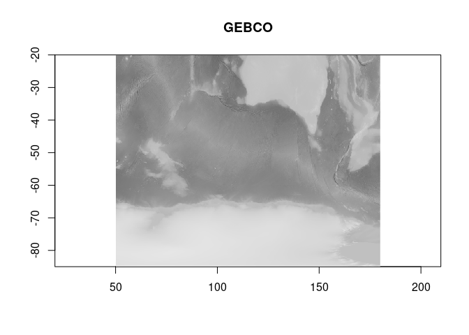
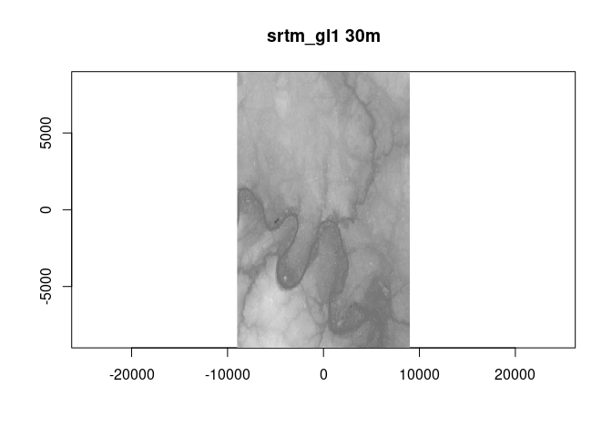

<!-- README.md is generated from README.Rmd. Please edit that file -->

# topography

<!-- badges: start -->
<!-- badges: end -->

The goal of topography is to provide configurations to some big player
topography sources. These are intended for use directly via GDAL (see
for example [gdalio](https://github.com/hypertidy/gdalio)) but we only
really need text processing stuff here, no actual spatial stuff.

## Installation

You can install the development version from
[GitHub](https://github.com/) with:

``` r
remotes::install_github("hypertidy/topography")
#options(repos = c(
#    hypertidy = 'https://hypertidy.r-universe.dev',
#    CRAN = 'https://cloud.r-project.org'))
#install.packages("topography")
```

## Example

This is a basic example showing a few sources and read via GDAL into
matching grids.

``` r
library(gdalio)
source(system.file("raster_format/raster_format.codeR", package = "gdalio", mustWork = TRUE))
## read as matrix
# gdalio_matrix <- function(dsn, ...) {
#   v <- gdalio_data(dsn, ...)
#   g <- gdalio_get_default_grid()
#   matrix(v[[1]], g$dimension[1])[,g$dimension[2]:1, drop = FALSE]
# }
## plot the data
gdalio_plot <- function(x, col = grey.colors(256), ..., asp = 1,  useRaster = TRUE) {
  g <- gdalio_get_default_grid()
  image(list(x = seq(g$extent[1], g$extent[2], length.out = g$dimension[1] + 1),
             y = seq(g$extent[3], g$extent[4], length.out = g$dimension[2] + 1),
             z = x), col = col, ..., useRaster = useRaster, asp = asp)
}

## set default grid to use as target
gdalio_set_default_grid(list(extent = c(50, 180, -85, -20),
 dimension = as.integer(c(1024, 512)),
 projection = "OGC:CRS84"))

## package to configure some transparent online topography sources
library(topography)

gebco <- gdalio_matrix(topography_source(x = "gebco"))
gdalio_plot(gebco, main = "GEBCO", asp = 1.6)
```



``` r
## for SRTM we want much smaller regions WIP

ll <- cbind(55.7558, 37.6173)[,2:1, drop = FALSE]
g <- list(extent = c(-1, 1, -1, 1) * 9000, dimension = c(512, 512), projection = sprintf("+proj=laea +lon_0=%f +lat_0=%f", ll[1], ll[2]))
gdalio_set_default_grid(g)
srtm <- gdalio_matrix(topography_source(x = "srtm_gl1"))
gdalio_plot(srtm, main = "srtm_gl1 30m", asp = 1.6)

gdalio_raster(topography_source(x = "srtm_gl1"))
#> Warning: multiple methods tables found for 'approxNA'
```



    #> class      : RasterLayer 
    #> dimensions : 512, 512, 262144  (nrow, ncol, ncell)
    #> resolution : 35.15625, 35.15625  (x, y)
    #> extent     : -9000, 9000, -9000, 9000  (xmin, xmax, ymin, ymax)
    #> crs        : +proj=laea +lat_0=55.7558 +lon_0=37.6173 +x_0=0 +y_0=0 +datum=WGS84 +units=m +no_defs 
    #> source     : memory
    #> names      : layer 
    #> values     : 100, 223  (min, max)

------------------------------------------------------------------------

## Code of Conduct

Please note that the topography project is released with a [Contributor
Code of
Conduct](https://contributor-covenant.org/version/2/0/CODE_OF_CONDUCT.html).
By contributing to this project, you agree to abide by its terms.
